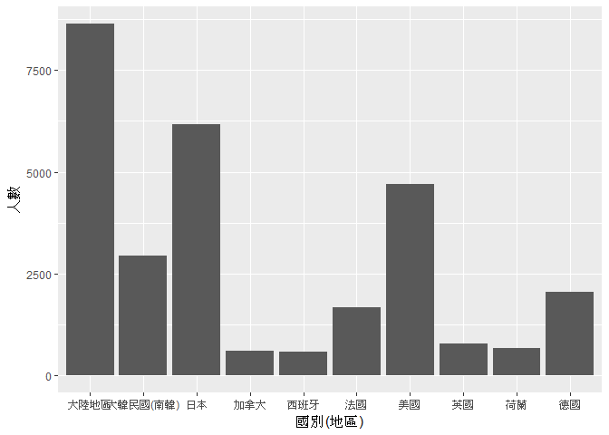

106-2 大數據分析方法 作業二
================
Yi-Ju Tseng

作業完整說明[連結](https://docs.google.com/document/d/1aLGSsGXhgOVgwzSg9JdaNz2qGPQJSoupDAQownkGf_I/edit?usp=sharing)

學習再也不限定在自己出生的國家，台灣每年有許多學生選擇就讀國外的大專院校，同時也有人多國外的學生來台灣就讀，透過分析[大專校院境外學生人數統計](https://data.gov.tw/dataset/6289)、[大專校院本國學生出國進修交流數](https://data.gov.tw/dataset/24730)、[世界各主要國家之我國留學生人數統計表](https://ws.moe.edu.tw/Download.ashx?u=C099358C81D4876CC7586B178A6BD6D5062C39FB76BDE7EC7685C1A3C0846BCDD2B4F4C2FE907C3E7E96F97D24487065577A728C59D4D9A4ECDFF432EA5A114C8B01E4AFECC637696DE4DAECA03BB417&n=4E402A02CE6F0B6C1B3C7E89FDA1FAD0B5DDFA6F3DA74E2DA06AE927F09433CFBC07A1910C169A1845D8EB78BD7D60D7414F74617F2A6B71DC86D17C9DA3781394EF5794EEA7363C&icon=..csv)可以了解103年以後各大專院校國際交流的情形。請同學分析以下議題，並以視覺化的方式呈現分析結果，呈現103年以後大專院校國際交流的情形。

來台境外生分析
--------------

### 資料匯入與處理

``` r
#這是R Code Chunk
```

### 哪些國家來台灣唸書的學生最多呢？

``` r
#這是R Code Chunk
library(knitr)
```

    ## Warning: package 'knitr' was built under R version 3.4.4

``` r
library(ggplot2)
```

    ## Warning: package 'ggplot2' was built under R version 3.4.4

``` r
library(readr)
```

    ## Warning: package 'readr' was built under R version 3.4.4

``` r
library(dplyr)
```

    ## 
    ## Attaching package: 'dplyr'

    ## The following objects are masked from 'package:stats':
    ## 
    ##     filter, lag

    ## The following objects are masked from 'package:base':
    ## 
    ##     intersect, setdiff, setequal, union

``` r
fore103<-read_csv("https://quality.data.gov.tw/dq_download_csv.php?nid=6289&md5_url=25f64d5125016dcd6aed42e50c972ed0")
```

    ## Parsed with column specification:
    ## cols(
    ##   洲別 = col_character(),
    ##   國別 = col_character(),
    ##   `學位生-正式修讀學位外國生` = col_integer(),
    ##   `學位生-僑生(含港澳)` = col_integer(),
    ##   `學位生-正式修讀學位陸生` = col_integer(),
    ##   `非學位生-外國交換生` = col_integer(),
    ##   `非學位生-外國短期研習及個人選讀` = col_integer(),
    ##   `非學位生-大專附設華語文中心學生` = col_integer(),
    ##   `非學位生-大陸研修生` = col_integer(),
    ##   `非學位生-海青班` = col_integer(),
    ##   境外專班 = col_integer()
    ## )

``` r
fore104<-read_csv("https://quality.data.gov.tw/dq_download_csv.php?nid=6289&md5_url=4d3e9b37b7b0fd3aa18a388cdbc77996")
```

    ## Parsed with column specification:
    ## cols(
    ##   洲別 = col_character(),
    ##   國別 = col_character(),
    ##   `學位生-正式修讀學位外國生` = col_integer(),
    ##   `學位生-僑生(含港澳)` = col_integer(),
    ##   `學位生-正式修讀學位陸生` = col_integer(),
    ##   `非學位生-外國交換生` = col_integer(),
    ##   `非學位生-外國短期研習及個人選讀` = col_integer(),
    ##   `非學位生-大專附設華語文中心學生` = col_integer(),
    ##   `非學位生-大陸研修生` = col_integer(),
    ##   `非學位生-海青班` = col_integer(),
    ##   境外專班 = col_integer()
    ## )

``` r
fore105<-read_csv("https://quality.data.gov.tw/dq_download_csv.php?nid=6289&md5_url=19bedf88cf46999da12513de755c33c6")
```

    ## Parsed with column specification:
    ## cols(
    ##   洲別 = col_character(),
    ##   國別 = col_character(),
    ##   學位生_正式修讀學位外國生 = col_integer(),
    ##   `學位生_僑生(含港澳)` = col_integer(),
    ##   學位生_正式修讀學位陸生 = col_integer(),
    ##   非學位生_外國交換生 = col_integer(),
    ##   非學位生_外國短期研習及個人選讀 = col_integer(),
    ##   非學位生_大專附設華語文中心學生 = col_integer(),
    ##   非學位生_大陸研修生 = col_integer(),
    ##   非學位生_海青班 = col_integer(),
    ##   境外專班 = col_integer()
    ## )

``` r
fore106<-read_csv("https://quality.data.gov.tw/dq_download_csv.php?nid=6289&md5_url=50e3370f9f8794f2054c0c82a2ed8c91")
```

    ## Parsed with column specification:
    ## cols(
    ##   洲別 = col_character(),
    ##   國別 = col_character(),
    ##   學位生_正式修讀學位外國生 = col_integer(),
    ##   `學位生_僑生(含港澳)` = col_integer(),
    ##   學位生_正式修讀學位陸生 = col_integer(),
    ##   非學位生_外國交換生 = col_integer(),
    ##   非學位生_外國短期研習及個人選讀 = col_integer(),
    ##   非學位生_大專附設華語文中心學生 = col_integer(),
    ##   非學位生_大陸研修生 = col_integer(),
    ##   非學位生_海青班 = col_integer(),
    ##   境外專班 = col_integer()
    ## )

``` r
colnames(fore103)<-c("洲別","國別","學位生_正式修讀學位外國生","學位生_僑生(含港澳)","學位生_正式修讀學位陸生","非學位生_外國交換生","非學位生_外國短期研習及個人選讀","非學位生_大專附設華語文中心學生","非學位生_大陸研修生","非學位生_海青班","境外專班")
colnames(fore104)<-c("洲別","國別","學位生_正式修讀學位外國生","學位生_僑生(含港澳)","學位生_正式修讀學位陸生","非學位生_外國交換生","非學位生_外國短期研習及個人選讀","非學位生_大專附設華語文中心學生","非學位生_大陸研修生","非學位生_海青班","境外專班")
fore103to106<-rbind(fore103,fore104,fore105,fore106)
for(i in 1:nrow(fore103to106)){
  fore103to106$sum[i]<-sum(fore103to106[i,3:11])
}
```

    ## Warning: Unknown or uninitialised column: 'sum'.

``` r
fore103to106<-fore103to106[order(fore103to106$sum,decreasing=T),]

country<-head(unique(fore103to106$國別),10)
people<-NULL
for(i in 1:10){
  people[i]<-sum(subset(fore103to106,國別==country[i],select="sum"))
}
country
```

    ##  [1] "中國大陸" "馬來西亞" "香港"     "日本"     "越南"     "印尼"    
    ##  [7] "澳門"     "南韓"     "美國"     "泰國"

``` r
people
```

    ##  [1] 152524  62031  31940  28200  21670  19620  20302  16948  14846   7035

### 哪間大學的境外生最多呢？

``` r
library(ggplot2)
library(readr)
library(dplyr)
f103<-read_csv("https://quality.data.gov.tw/dq_download_csv.php?nid=6289&md5_url=a6d1469f39fe41fb81dbfc373aef3331")
```

    ## Parsed with column specification:
    ## cols(
    ##   學校類型 = col_character(),
    ##   學校代碼 = col_character(),
    ##   學校名稱 = col_character(),
    ##   `學位生-正式修讀學位外國生` = col_integer(),
    ##   `學位生-僑生(含港澳)` = col_integer(),
    ##   `學位生-正式修讀學位陸生` = col_integer(),
    ##   `非學位生-外國交換生` = col_integer(),
    ##   `非學位生-外國短期研習及個人選讀` = col_integer(),
    ##   `非學位生-大專附設華語文中心學生` = col_integer(),
    ##   `非學位生-大陸研修生` = col_character(),
    ##   `非學位生-海青班` = col_integer(),
    ##   境外專班 = col_integer()
    ## )

``` r
f104<-read_csv("https://quality.data.gov.tw/dq_download_csv.php?nid=6289&md5_url=8baeae81cba74f35cf0bb1333d3d99f5")
```

    ## Parsed with column specification:
    ## cols(
    ##   學校類型 = col_character(),
    ##   學校代碼 = col_character(),
    ##   學校名稱 = col_character(),
    ##   `學位生-正式修讀學位外國生` = col_integer(),
    ##   `學位生-僑生(含港澳)` = col_integer(),
    ##   `學位生-正式修讀學位陸生` = col_integer(),
    ##   `非學位生-外國交換生` = col_integer(),
    ##   `非學位生-外國短期研習及個人選讀` = col_integer(),
    ##   `非學位生-大專附設華語文中心學生` = col_integer(),
    ##   `非學位生-大陸研修生` = col_character(),
    ##   `非學位生-海青班` = col_integer(),
    ##   境外專班 = col_integer()
    ## )

``` r
f105<-read_csv("https://quality.data.gov.tw/dq_download_csv.php?nid=6289&md5_url=1a485383cf9995da679c3798ab4fd681")
```

    ## Parsed with column specification:
    ## cols(
    ##   學校類型 = col_character(),
    ##   學校代碼 = col_character(),
    ##   學校名稱 = col_character(),
    ##   學位生_正式修讀學位外國生 = col_integer(),
    ##   `學位生_僑生(含港澳)` = col_integer(),
    ##   學位生_正式修讀學位陸生 = col_integer(),
    ##   非學位生_外國交換生 = col_integer(),
    ##   非學位生_外國短期研習及個人選讀 = col_integer(),
    ##   非學位生_大專附設華語文中心學生 = col_integer(),
    ##   非學位生_大陸研修生 = col_integer(),
    ##   非學位生_海青班 = col_integer(),
    ##   境外專班 = col_integer()
    ## )

``` r
f106<-read_csv("https://quality.data.gov.tw/dq_download_csv.php?nid=6289&md5_url=883e2ab4d5357f70bea9ac44a47d05cc")
```

    ## Parsed with column specification:
    ## cols(
    ##   學校類型 = col_character(),
    ##   學校代碼 = col_character(),
    ##   學校名稱 = col_character(),
    ##   學位生_正式修讀學位外國生 = col_integer(),
    ##   `學位生_僑生(含港澳)` = col_integer(),
    ##   學位生_正式修讀學位陸生 = col_integer(),
    ##   非學位生_外國交換生 = col_integer(),
    ##   非學位生_外國短期研習及個人選讀 = col_integer(),
    ##   非學位生_大專附設華語文中心學生 = col_integer(),
    ##   非學位生_大陸研修生 = col_integer(),
    ##   非學位生_海青班 = col_integer(),
    ##   境外專班 = col_integer()
    ## )

``` r
colnames(f103)<-c("學校類型","學校代碼","學校名稱","學位生_正式修讀學位外國生","學位生_僑生(含港澳)","學位生_正式修讀學位陸生","非學位生_外國交換生","非學位生_外國短期研習及個人選讀","非學位生_大專附設華語文中心學生","非學位生_大陸研修生","非學位生_海青班","境外專班")
colnames(f104)<-c("學校類型","學校代碼","學校名稱","學位生_正式修讀學位外國生","學位生_僑生(含港澳)","學位生_正式修讀學位陸生","非學位生_外國交換生","非學位生_外國短期研習及個人選讀","非學位生_大專附設華語文中心學生","非學位生_大陸研修生","非學位生_海青班","境外專班")
f103to106<-rbind(f103,f104,f105,f106)
f103to106$非學位生_大陸研修生<-gsub("…","0",f103to106$非學位生_大陸研修生)
f103to106$非學位生_大陸研修生<-as.numeric(f103to106$非學位生_大陸研修生)
for(i in 1:nrow(f103to106)){
  f103to106$sum[i]<-sum(f103to106[i,4:12])
}
```

    ## Warning: Unknown or uninitialised column: 'sum'.

``` r
f103to106<-f103to106[order(f103to106$sum,decreasing=T),]
f103to106<-f103to106[-1:-3,]
school<-head(unique(f103to106$學校名稱),10)
people<-NULL
for(i in 1:10){
  people[i]<-sum(subset(f103to106,學校名稱==school[i],select="sum"))
}
school
```

    ##  [1] "國立臺灣師範大學" "國立臺灣大學"     "銘傳大學"        
    ##  [4] "中國文化大學"     "淡江大學"         "國立成功大學"    
    ##  [7] "國立政治大學"     "中原大學"         "逢甲大學"        
    ## [10] "輔仁大學"

``` r
people
```

    ##  [1] 22113 18199 16057 16074 13887 10982 11626  7662  9474  9499

### 各個國家來台灣唸書的學生人數條狀圖

``` r
library(ggplot2)
countryDF<-data.frame(國別=country,
                      人數=people)
ggplot()+geom_bar(data=countryDF,aes(國別,人數),stat = "identity")
```


### 各個國家來台灣唸書的學生人數面量圖

``` r
#這是R Code Chunk
```

台灣學生國際交流分析
--------------------

### 資料匯入與處理

``` r
library(readr)
library(dplyr)
taiwanout<-read_csv("C:/Users/win/Desktop/Student_RPT_07.csv",skip=2)
```

    ## Warning: Duplicated column names deduplicated: '1' => '1_1' [13], '1' =>
    ## '1_2' [14]

    ## Parsed with column specification:
    ## cols(
    ##   `102` = col_integer(),
    ##   `2` = col_integer(),
    ##   公立 = col_character(),
    ##   一般大學 = col_character(),
    ##   `1` = col_integer(),
    ##   國立政治大學 = col_character(),
    ##   `220326` = col_integer(),
    ##   土耳其語文學系 = col_character(),
    ##   `學士班(日間)` = col_character(),
    ##   土耳其 = col_character(),
    ##   伊斯坦堡大學 = col_character(),
    ##   `ISTANBUL UNIVERSITY` = col_character(),
    ##   `1_1` = col_integer(),
    ##   `1_2` = col_integer(),
    ##   `0` = col_integer()
    ## )

    ## Warning in rbind(names(probs), probs_f): number of columns of result is not
    ## a multiple of vector length (arg 1)

    ## Warning: 27 parsing failures.
    ## row # A tibble: 5 x 5 col     row col    expected               actual file                          expected   <int> <chr>  <chr>                  <chr>  <chr>                         actual 1  2614 220326 no trailing characters A2     'C:/Users/win/Desktop/Studen~ file 2  2926 220326 no trailing characters A2     'C:/Users/win/Desktop/Studen~ row 3 17510 1      no trailing characters R01    'C:/Users/win/Desktop/Studen~ col 4 22688 1      no trailing characters R01    'C:/Users/win/Desktop/Studen~ expected 5 23289 1      no trailing characters R01    'C:/Users/win/Desktop/Studen~
    ## ... ................. ... .......................................................................... ........ .......................................................................... ...... .......................................................................... .... .......................................................................... ... .......................................................................... ... .......................................................................... ........ ..........................................................................
    ## See problems(...) for more details.

``` r
colnames(taiwanout)<- c("年度","學期","設立別","學校類別","學校代碼","學校名稱","系所代碼","系所名稱","學制","國別(地區)","對方學校(機構)名稱","英文名稱","小計","男","女")
```

### 台灣大專院校的學生最喜歡去哪些國家進修交流呢？

``` r
group_by(taiwanout,`國別(地區)`)%>%
  summarise(人數=n())%>%
  arrange(desc(人數))%>%
  head(10)
```

    ## Warning: package 'bindrcpp' was built under R version 3.4.4

    ## # A tibble: 10 x 2
    ##    `國別(地區)`    人數
    ##    <chr>          <int>
    ##  1 大陸地區        8640
    ##  2 日本            6160
    ##  3 美國            4709
    ##  4 大韓民國(南韓)  2931
    ##  5 德國            2046
    ##  6 法國            1671
    ##  7 英國             773
    ##  8 荷蘭             669
    ##  9 加拿大           610
    ## 10 西班牙           575

### 哪間大學的出國交流學生數最多呢？

``` r
group_by(taiwanout,學校名稱)%>%
  summarise(人數=n())%>%
  arrange(desc(人數))%>%
  head(10)
```

    ## # A tibble: 10 x 2
    ##    學校名稱          人數
    ##    <chr>            <int>
    ##  1 國立臺灣大學      3548
    ##  2 國立政治大學      2983
    ##  3 淡江大學          1208
    ##  4 國立交通大學      1197
    ##  5 國立清華大學      1059
    ##  6 國立成功大學      1058
    ##  7 國立臺灣師範大學  1037
    ##  8 東海大學           984
    ##  9 逢甲大學           977
    ## 10 輔仁大學           810

### 台灣大專院校的學生最喜歡去哪些國家進修交流條狀圖

``` r
library(ggplot2)
library(dplyr)
collegedf<-group_by(taiwanout,`國別(地區)`)%>%
  summarise(人數=n())%>%
  arrange(desc(人數))%>%
  head(10)

ggplot()+geom_bar(data=collegedf,aes(`國別(地區)`,人數),stat = "identity")
```



### 台灣大專院校的學生最喜歡去哪些國家進修交流面量圖

``` r
#這是R Code Chunk
```

台灣學生出國留學分析
--------------------

### 資料匯入與處理

``` r
library(readr)
library(dplyr)
taiwan<-read_csv("https://ws.moe.edu.tw/Download.ashx?u=C099358C81D4876CC7586B178A6BD6D5062C39FB76BDE7EC7685C1A3C0846BCDD2B4F4C2FE907C3E7E96F97D24487065577A728C59D4D9A4ECDFF432EA5A114C8B01E4AFECC637696DE4DAECA03BB417&n=4E402A02CE6F0B6C1B3C7E89FDA1FAD0B5DDFA6F3DA74E2DA06AE927F09433CFBC07A1910C169A1845D8EB78BD7D60D7414F74617F2A6B71DC86D17C9DA3781394EF5794EEA7363C&icon=..csv")
```

    ## Warning: Missing column names filled in: 'X4' [4], 'X5' [5], 'X6' [6]

    ## Parsed with column specification:
    ## cols(
    ##   洲別 = col_character(),
    ##   國別 = col_character(),
    ##   總人數 = col_number(),
    ##   X4 = col_character(),
    ##   X5 = col_character(),
    ##   X6 = col_character()
    ## )

``` r
taiwan$X4<-NULL
taiwan$X5<-NULL
taiwan$X6<-NULL
```

### 台灣學生最喜歡去哪些國家留學呢？

``` r
arrange(taiwan,desc(總人數))%>%
  select("國別")%>%
  head(10)
```

    ## # A tibble: 10 x 1
    ##    國別    
    ##    <chr>   
    ##  1 美國    
    ##  2 澳大利亞
    ##  3 日本    
    ##  4 加拿大  
    ##  5 英國    
    ##  6 德國    
    ##  7 紐西蘭  
    ##  8 波蘭    
    ##  9 馬來西亞
    ## 10 奧地利

### 台灣學生最喜歡去哪些國家留學面量圖

``` r
#這是R Code Chunk
```

綜合分析
--------

請問來台讀書與離台讀書的來源國與留學國趨勢是否相同(5分)？想來台灣唸書的境外生，他們的母國也有很多台籍生嗎？請圖文並茂說明你的觀察(10分)。
